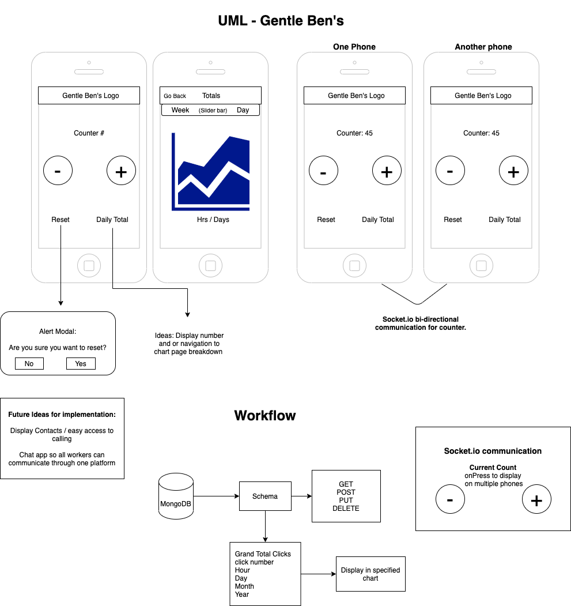

# Express Server and Mongodb for Gentle Ben's Tuscan, AZ

PORT=3000

## Deployed Backend Express Server

- [Keeptrack-gentlebens](https://keeptrack-gentlebens.herokuapp.com/)

## Deployed React Native Frontend

- [Expo go Project](https://expo.io/@stacyjane/keeptrack-gentlebens)

Developed By:

- [Stacy Burris](https://github.com/stacyburris)
- [J.P. Jones](https://github.com/4a50)
